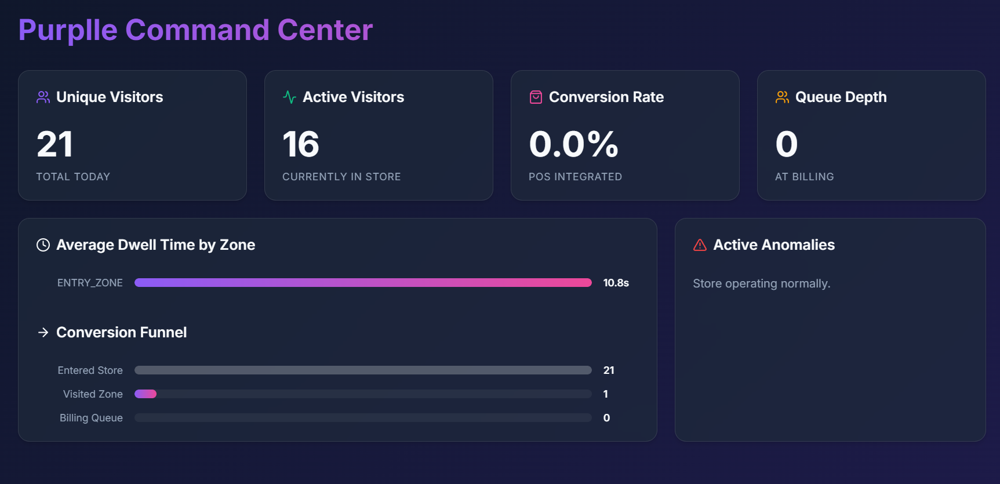

# Purplle Store Intelligence API



This repository contains the end-to-end Store Intelligence API, which processes physical CCTV footage and exposes real-time business metrics.

## Getting Started

You can run the entire Intelligence API stack in exactly 2 commands using Docker.

```bash
# 1. Clone the repository
git clone https://github.com/anjali-panwar-creator/purplle-hackathon
cd purplle-hackathon

# 2. Start the API
docker compose up --build
```

The Golang API will now be listening on `http://localhost:8080`.

## Running the Detection Pipeline

The pipeline script uses Ultralytics YOLOv8 to process the raw `.mp4` CCTV footage and emit structural JSON events to the running API.

Open a new terminal window and run:

```bash
# Navigate to the pipeline directory
cd pipeline

# Install computer vision requirements
pip install -r requirements.txt

# Run the detection engine against a specific camera footage
# You can change the --video and --camera arguments to test different clips
python detect.py --video "../DATA/CCTV Footage-20260529T160731Z-3-00144614ea/CCTV Footage/CAM 1.mp4" --camera "CAM_FLOOR_01"
```

The script will stream structured events (ENTRY, EXIT, ZONE_ENTER, etc.) directly into `http://localhost:8080/events/ingest`.

**Testing Note for Judges:** 
If you want to test cross-camera deduplication, simply run the pipeline again on `CAM 2.mp4` while the Docker API is still running. The events will aggregate into the same database. 
If you want to wipe the database and start a completely fresh test, simply run `docker compose down` and then `docker compose up --build`. The SQLite database lives ephemerally inside the container and will automatically reset.

## Viewing the Live Dashboard (Bonus)

To see the metrics dynamically updating in real-time as the detection pipeline runs, start the React Dashboard:

```bash
cd frontend
npm install
npm run dev
```

Open `http://localhost:5173` in your browser to view the Command Center UI.

## Testing

To run the unit tests and verify statement coverage:
```bash
cd app
go test -v ./...
```
*(Note: Test files contain the required AI # PROMPT blocks at the top).*
